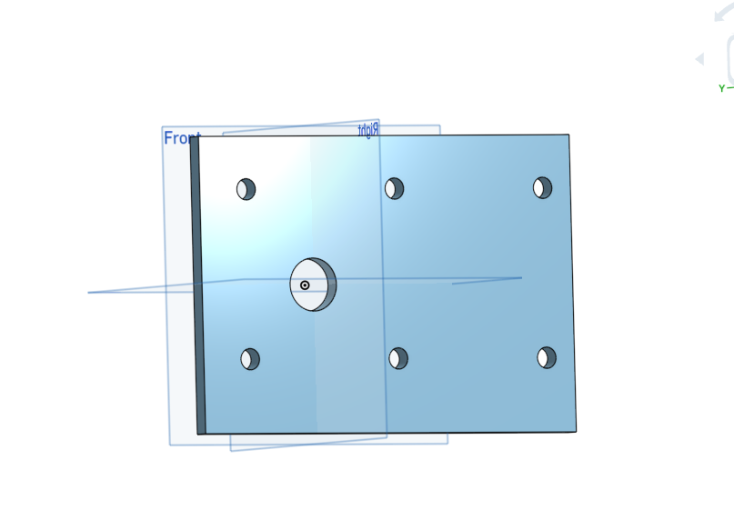

# basicCAD
## Making The Base

I learned how to use patterns in Onshape. I also learned a lot of the basic stuff like how to extrude and make a sketch. There was some problems because I didn't get a mouse until yesterday evening, but it was resolved. 
https://cvilleschools.onshape.com/documents/f5f705d991558d9a9a43d377/w/29a3bd6a2d142607837bad60/e/0277b911e70501b300776bb2
