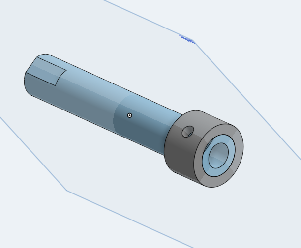

# basicCAD
## Making The Base

I learned how to use patterns in Onshape. I also learned a lot of the basic stuff like how to extrude and make a sketch. There was some problems because I didn't get a mouse until yesterday evening, but it was resolved. 
https://cvilleschools.onshape.com/documents/f5f705d991558d9a9a43d377/w/29a3bd6a2d142607837bad60/e/0277b911e70501b300776bb2

## Making the Mount

This one was really simple and took me almost no time at all.
https://cvilleschools.onshape.com/documents/3dc9b83a28707bae69e91a8b/w/483a2c9ee548282b6c09daeb/e/024312315d87d8212cd7eb80

## Making the Fork

This one included a lot of fillets. It was fun. 
https://cvilleschools.onshape.com/documents/c6ea21cf0922ef3fa70cd97b/w/bbe550558dcea28974abf564/e/36f52377802f32faa6f2458b

## Making the Tire

I learned how to revolve to create a part instead of having to extrude it. 
https://cvilleschools.onshape.com/documents/a7a71d4e06a11e9632028d01/w/57a19e77f713b81f5dca9082/e/b7914f6d1d97830752c965ee

## Making The WHeel

I used a circular pattern to create the spokes, which was pretty cool. I also used a revolve extrude, which i hadn't before. There were a lot of circles in this one, which was cool cas i like circles.
https://cvilleschools.onshape.com/documents/721de13ff9da5e2e21d3264e/w/e1c6234713ba8b456ce47a6e/e/f8afc5b8d62b02824397fb37

## making The Axle and The Collar

SO this is two different parts that were put together in the same document. It was pretty cool to do that and learn how to. 
https://cvilleschools.onshape.com/documents/e5eb23f3072f88019ce282c0/w/9d70ec53ff9ccc55d4ee9861/e/0d3dde0b8668a38c50b25038

## Making the Bearing

This was just added onto the wheel. very quick.
https://cvilleschools.onshape.com/documents/721de13ff9da5e2e21d3264e/w/e1c6234713ba8b456ce47a6e/e/f8afc5b8d62b02824397fb37

## Making Big Bearing

Just two very qquick circles extruded.
https://cvilleschools.onshape.com/documents/1279d84991771e72ae2d17bc/w/3becea321b750fc923cf6fcb/e/e6e2512b9477721b6d54b243

## SubAssembly

Learned about the revolute and fasten mates. This was fun, can't wait to complete it!!
https://cvilleschools.onshape.com/documents/502ca0e03613d67dbeb04c4b/w/49493cdba123a2704f9de310/e/3e958f2b6401a6168f08353d

## Final Assembly

Used a lot of revolute mates. 
https://cvilleschools.onshape.com/documents/7e89f92bd98fc47904c261e1/w/ee354934d0978f8231917c31/e/326e0080f71e5f6b877c6681
