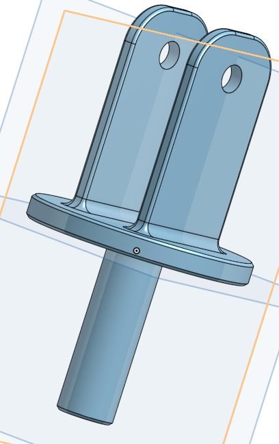

# basicCAD
## Making The Base

I learned how to use patterns in Onshape. I also learned a lot of the basic stuff like how to extrude and make a sketch. There was some problems because I didn't get a mouse until yesterday evening, but it was resolved. 
https://cvilleschools.onshape.com/documents/f5f705d991558d9a9a43d377/w/29a3bd6a2d142607837bad60/e/0277b911e70501b300776bb2

## Making the Mount

This one was really simple and took me almost no time at all.
https://cvilleschools.onshape.com/documents/3dc9b83a28707bae69e91a8b/w/483a2c9ee548282b6c09daeb/e/024312315d87d8212cd7eb80

## Making the Fork

This one included a lot of fillets. It was fun. 
https://cvilleschools.onshape.com/documents/c6ea21cf0922ef3fa70cd97b/w/bbe550558dcea28974abf564/e/36f52377802f32faa6f2458b

## Making the Tire

I learned how to revolve to create a part instead of having to extrude it. 
https://cvilleschools.onshape.com/documents/a7a71d4e06a11e9632028d01/w/57a19e77f713b81f5dca9082/e/b7914f6d1d97830752c965ee

## Making The WHeel

I used a circular pattern to create the spokes, which was pretty cool. I also used a revolve extrude, which i hadn't before. There were a lot of circles in this one, which was cool cas i like circles.
https://cvilleschools.onshape.com/documents/721de13ff9da5e2e21d3264e/w/e1c6234713ba8b456ce47a6e/e/f8afc5b8d62b02824397fb37
